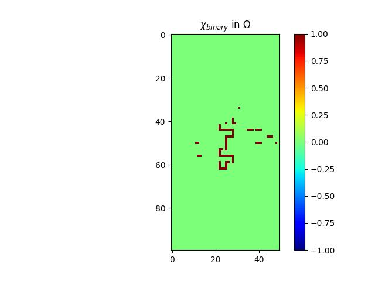
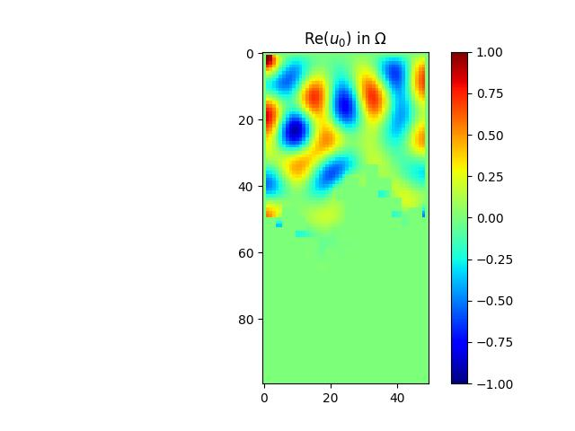

# Noise-absorption-with-fractal
PDE-constrained topology optimization for railway noise barriers. Implements adjoint method for Helmholtz equation to compute gradients and optimizes material distribution χ(x) ∈ [0,1] balancing acoustic performance and material cost. Targets wheel-rail rolling noise (600-1100 Hz).

## Context
Railway noise is a major urban pollution issue, particularly in the Paris region where dense RER traffic exposes thousands of residents to sound levels exceeding WHO recommendations. This project focuses on optimizing noise barrier design to mitigate railway noise through mathematical modeling and numerical optimization.

### Key Problem Parameters

- **Target Frequency Range**: 600 Hz - 1100 Hz (wheel-rail rolling noise dominant at ~100 km/h)
- **Noise Source**: Wheel-rail contact modeled as a Gaussian linear source
- **Approach**: Topology optimization combining porous absorbing materials with reflective barriers

## Mathematical Model

### 1. Acoustic Wave Propagation

The acoustic pressure field $u(y,w)$ satisfies the **Helmholtz equation** on the propagation domain $\Omega$
$
\Delta u + k^2u
$

where:
- $ k = ω/c $ is the wave number (ω: angular frequency, c: sound speed ≈ 340 m/s)
- Robin condition modelise the worst situation : a reflexive tunnel 

### 2. Boundary Conditions

- **Porous material (absorbing)**: Robin boundary condition on $\partial \Omega$
  $
  ∂u/∂n + \alpha\chi\u = 0
  $

- **Rigid barrier (reflecting)**: Neumann condition on  $\partial \Omega_{Neumann}$
$
∂p/∂n = 0 
$

- **Rigid barrier (reflecting)**: Dirichlet condition on $∂\Omega_{Dirichlet}$
  $
  u = g 
  $

### 3. Noise Source Model

The railway noise source is modeled as a Gaussian distribution centered at the wheel-rail contact point:

$$
g(y) = (10 / √(2π)σ) × exp(-y² / 2σ²)
$$
The situation is resumed in the figure below

  

### Results

We determine the optimal spatial distribution of χ by minimizing the acoustic energy through a gradient descent algorithm. The optimization iteratively updates χ to reduce the radiated energy, leading to a material configuration that achieves significantly improved noise attenuation. The resulting optimized χ distribution and the corresponding energy reduction are illustrated in the figures below.

  

    
    

      χ distribution after optimization
    

  

  

    
    

      Acoustical energy after optimization
    

  

